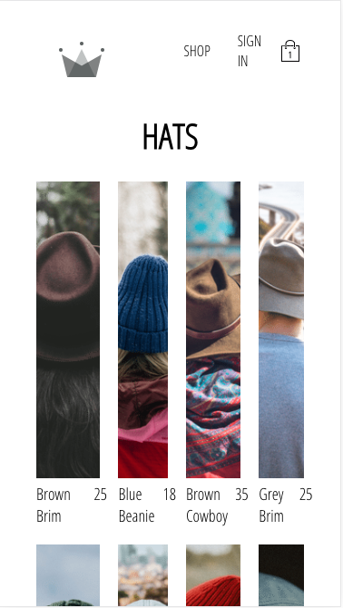
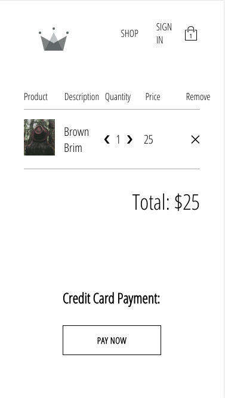
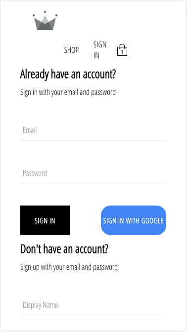

# How to fork and clone

One quick note about cloning this project. If you wish to make commits and push your own code, you'll need to fork the project first. Forking allows you to have your own copy of this repository by adding a duplicate version in your own profile!

You can see the fork button in the top right corner of every GitHub project; click it and a copy of the project will be added to your GitHub profile under the same name as the original project.

After forking the project, simply clone it the way you would from the new forked project in your own GitHub repository and you can commit and push to it freely!

# After you fork and clone:

## Install dependencies

In your terminal after you clone your project down, remember to run either `yarn` or `npm install` to build all the dependencies in the project.

## Set your firebase config

Remember to replace the config variable in your firebase.utils.js with your own config object from the firebase dashboard! Navigate to the project settings gear icon > project settings and scroll down to the config code. Copy the object in the code and replace the variable in your cloned code.

